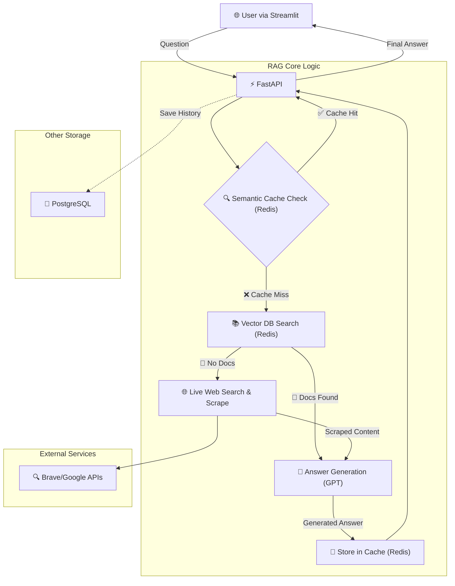

# 🌍 IM.FACT Organization

**신뢰할 수 있는 환경·기후변화 정보를 제공하는 AI 어시스턴트**

---

## 🚀 프로젝트 소개

IM.FACT는 **환경, 기후변화, 지속가능성**에 관한 신뢰할 수 있는 정보를 제공하는 AI 어시스턴트입니다. RAG(Retrieval Augmented Generation) 기술을 활용하여 신뢰성 있는 출처에서 실시간으로 정보를 수집하고, 과학적이고 균형 잡힌 답변을 제공합니다.

### ✨ 핵심 특징

- **🔍 실시간 정보 수집**: 신뢰할 수 있는 환경·기후 관련 웹사이트에서 최신 정보 스크래핑
- **🧠 RAG 기반 답변**: Redis Vector Search와 OpenAI GPT를 활용한 정확한 답변 생성  
- **📚 출처 투명성**: 모든 답변에 신뢰할 수 있는 출처 정보 제공
- **💨 빠른 응답**: 시멘틱 캐시로 유사한 질문에 즉시 답변
- **📱 사용자 친화적**: 현대적이고 반응형인 채팅 인터페이스

---

## 🏗️ 기술 스택

### 🔧 백엔드
- **FastAPI** - 고성능 Python 웹 프레임워크
- **PostgreSQL** - 사용자 데이터 및 채팅 기록 저장
- **Redis 8.0** - Vector Search 및 시멘틱 캐시
- **OpenAI GPT** - 자연어 처리 및 답변 생성
- **Brave Search API** - 실시간 웹 검색
- **Google Custom Search API** - 추가 검색 소스
- **Playwright** - 웹 스크래핑 및 동적 콘텐츠 추출
- **Docker** - 컨테이너화 및 배포

### 🎨 프론트엔드  
- **Streamlit** - 빠른 프로토타이핑을 위한 Python 웹 프레임워크
- **반응형 CSS** - 모바일/데스크톱 최적화
- **실시간 채팅 UI** - 세련된 스타일의 현대적 인터페이스

---

## 📊 아키텍처



### 🔄 RAG 워크플로우

1. **질문 입력**: 사용자가 환경/기후 관련 질문을 입력합니다.
2. **시맨틱 캐시 확인**: 먼저 Redis의 시맨틱 캐시에서 유사도가 매우 높은 기존 질문-답변 쌍이 있는지 검색합니다. (Cache-First)
3. **캐시 히트 (Cache Hit)**: 유사한 질문이 존재하면, 캐시된 답변을 즉시 반환하여 응답 시간을 최소화합니다.
4. **캐시 미스 (Cache Miss) 및 RAG 파이프라인 가동**:
    - **Vector DB 검색**: 캐시에 적합한 답변이 없을 경우, Redis Vector DB에서 관련성 높은 문서 조각(사전 스크랩된 정보)을 검색합니다.
    - **실시간 웹 검색 (Fallback)**: Vector DB에서 유의미한 정보를 찾지 못하면, Brave Search, Google API 등을 통해 실시간으로 웹에서 최신 정보를 검색하고 스크래핑합니다.
5. **답변 생성**: Vector DB에서 찾은 문서 또는 실시간으로 수집된 최신 정보를 근거 자료로 사용하여, OpenAI GPT가 종합적이고 신뢰성 있는 답변을 생성합니다.
6. **출처 제공 및 캐시 저장**: 생성된 답변과 함께 신뢰할 수 있는 출처 정보를 사용자에게 제공합니다. 또한, 향후 유사한 질문에 빠르게 응답할 수 있도록 새로운 질문과 답변 쌍을 시맨틱 캐시에 저장합니다.

---

## 🎯 주요 기능

### 💬 지능형 채팅
- 자연어로 환경·기후변화 질문 가능
- 실시간 타이핑 인디케이터
- 채팅 기록 저장 및 관리

### 📖 신뢰할 수 있는 출처
- IPCC, NASA, 기상청 등 공신력 있는 기관 데이터 우선 활용
- 모든 답변에 출처 URL 제공
- 출처별 신뢰도 표시

### ⚡ 고성능 처리
- Redis Vector Search로 빠른 유사도 검색
- 시멘틱 캐시로 응답 시간 단축
- 비동기 처리로 동시 사용자 지원

### 🔐 보안 및 확장성
- 환경변수 기반 설정 관리
- Docker 컨테이너화
- 모듈화된 아키텍처

---

## 🚀 빠른 시작

### 로컬 개발 환경

```bash
# 1. 리포지토리 클론
git clone https://github.com/your-org/climate-factcheck
cd climate-factcheck

# 2. 환경 변수 설정
cp backend/.env.example backend/.env
# 필요한 API 키들 설정 (OpenAI, Brave Search, Google Search 등)

# 3. Docker Compose로 실행
cd backend
docker-compose up --build

# 4. 프론트엔드 실행 (별도 터미널)
cd frontend
pip install -r requirements.txt
streamlit run app.py
```

---

## 📝 지원하는 주제들

### 🌡️ 기후변화
- 지구온난화 현황 및 전망
- 극한 기상 현상 분석
- 기후변화 영향 평가

### ♻️ 환경 정책
- 탄소중립 정책 및 현황
- 재생에너지 동향
- 환경 규제 정보

### 🌱 실천 방안
- 개인 단위 기후행동
- 기업 ESG 경영
- 지속가능한 생활 방식

---

## 🔧 개발 팀

이 프로젝트는 환경 보호에 관심 있는 개발팀에 의해 개발되고 있습니다.

### 🛠️ 개발 영역
- **백엔드**: FastAPI, RAG, 웹서치 시스템 개선
- **프론트엔드**: UI/UX 개선, 모바일 최적화

---

<div align="center">

**🌍 지구를 위한 신뢰할 수 있는 정보, IM.FACT와 함께하세요! 🌍**

</div> 
